# Pulumi Java AKS

This template provisions:

* Azure Resource Group
* AKS cluster CurrentKubernetesVersion `1.34.8`
* Optionally use an existing Pluralsight sandbox resource group

```mermaid
architecture-beta
    %% Define the services and groups
    service user(logos:cloud)[User]
    service linux(logos:linux-tux)[Linux Instance]
    service pulumi(logos:pulumi)[Pulumi v3245]
    
    group azure(logos:azure)[Azure Account]
    service aks(logos:kubernetes)[AKS Cluster] in azure
    
    %% Define the directional connections (L=Left, R=Right)
    user:R -- L:linux
    linux:R -- L:pulumi
    pulumi:R -- L:aks
```

using <https://www.mermaidflow.app/editor> i can see the icons



## Prerequisites

* Azure account with credits
* Pluralsight Hands-On Cloud Playground (optional)
* Java 17 or higher installed
* Gradle 9 or higher installed
* Pulumi CLI installed and logged in
* Azure CLI configured for your target subscription

## Local execution on Linux 🐧💻⚙️

* Install Pulumi

```bash
curl -fsSL https://get.pulumi.com | sh
bash
pulumi version
```

* Select the Pulumi stack

```bash
PULUMI_STACK="azure-k8s-playground"
pulumi stack select "aleon1220/kubernetes-azure-spinnaker/$PULUMI_STACK"
```

* Configure Azure subscription credentials

```bash
DOMAIN_TENANT="realhandsonlabs.com"
export ARM_TENANT_ID=$(curl -s https://login.microsoftonline.com/${DOMAIN_TENANT}/.well-known/openid-configuration | grep -o 'https://sts.windows.net/[^/]*' | cut -d '/' -f 4)
echo $ARM_TENANT_ID
```

* Set required service principal environment variables

```bash
export ARM_CLIENT_ID="<YOUR_APPLICATION_CLIENT_ID>"
export ARM_CLIENT_SECRET="<YOUR_SECRET>"
export ARM_SUBSCRIPTION_ID=$(az account show --query id -o tsv)
export ARM_TENANT_ID=$(az account show --query tenantId -o tsv)
```

* Login with Azure CLI using service principal

```bash
az login --service-principal --username $ARM_CLIENT_ID --password $ARM_CLIENT_SECRET --tenant $ARM_TENANT_ID
```

* Configure Pulumi to use explicit Azure credentials

```bash
pulumi config set azure-native:useDefaultAzureCredential false
pulumi config set azure-native:subscriptionId $ARM_SUBSCRIPTION_ID
```

* Build and validate the project

```bash
./gradlew clean build 2>&1
```

* Validate Pulumi config and deploy

```bash
pulumi config
pulumi config -j | jq
pulumi up
```

* Confirm Java is installed

```bash
java --version
```

* Set the Pulumi resource group name provided by Pluralsight Azure Sandbox

```bash
PLURALSIGHT_RG_NAME=$(az group list --query "[0].name" --output tsv)
pulumi config set resourceGroupName $PLURALSIGHT_RG_NAME
```

* Deploy the stack

```bash
pulumi up
```

* check structure of working dir

```bash
tree -L 2
```

* enable AKS add-on for ingress

do this after authenticating

```bash

CLUSTER_NAME=$(az aks list --query "[0].name")

az aks approuting enable --resource-group $PLURALSIGHT_RG_NAME --name $CLUSTER_NAME
```

---

## Local execution on Windows 💻🚀

### Spinnaker running in AKS via Pulumi IaC Windows

* from `root project` -> Build and validate the project

    ```PowerShell
    ./gradlew.bat clean build :kubernetes-azure-spinnaker:build
    ```

* working directory

    ```PowerShell
    $env:PULUMI_WOK_DIR = "kubernetes-azure-spinnaker"
    cd $env:PULUMI_WOK_DIR
    ```

* from `kubernetes-azure-spinnaker` Validate Pulumi config.
pulumi will ask you to authenticate and select or create a stack

    ```PowerShell
    pulumi config
    ```

* prepare for deploying the stack by selecting the target azure subscription

    ```PowerShell
    pulumi config set azure-native:subscriptionId $env:ARM_SUBSCRIPTION_ID
    ```

* disable default credential if using temp cloud sandboxes

    ```PowerShell
    pulumi config set azure-native:useDefaultAzureCredential false
    ```

* Set the Pulumi resource group name provided by Pluralsight Azure Sandbox

    ```PowerShell
    $env:PLURALSIGHT_RG_NAME = (az group list --query "[0].name" --output tsv)
    pulumi config set resourceGroupName $env:PLURALSIGHT_RG_NAME
    ```

* Deploy the stack

    ```PowerShell
    pulumi up
    ```

## Robust AKS kubeconfig connection linux

* Ensure the resource group and cluster name are set

```bash
if [ -z "$PLURALSIGHT_RG_NAME" ] || [ -z "$CLUSTER_NAME" ]; then
  echo "Error: PLURALSIGHT_RG_NAME or CLUSTER_NAME is not set."
fi

echo "proceed and connect"

```

* set clustername

    ```bash
    CLUSTER_NAME=$(az aks list --resource-group $PLURALSIGHT_RG_NAME --query "[0].name" -o tsv)
    ```

* obtain kubeconfig

    ```bash
    az aks get-credentials --resource-group "$PLURALSIGHT_RG_NAME" --name "$CLUSTER_NAME" --admin --overwrite-existing
    ```

* use the variable to load the context

```bash
export KUBECONFIG=$HOME/.kube/config:~/config
```

* Verify it worked

```bash
echo $CLUSTER_NAME
```

```bash
az aks list --query "[0].name" -o tsv
```

### Connect to the AKS cluster from linux

* Set kubectl credentials

    ```bash
    az aks get-credentials --resource-group $PLURALSIGHT_RG_NAME --name $CLUSTER_NAME --admin
    ```

* Verify cluster nodes

    ```bash
    kubectl get nodes
    ```

## AKS kubeconfig connection from Windows powershell

* get aks cluster

    ```powershell
    $env:CLUSTER_NAME = (az aks list --query "[0].name")
    ```

* get kubeconfig credentials

    ```powershell
    az aks get-credentials --resource-group $env:PLURALSIGHT_RG_NAME --name "$env:CLUSTER_NAME" --admin --overwrite-existing
    ```

* send the creds to WSL linux home

    ```powershell
    Copy-Item -Path "$env:USERPROFILE\.kube\config" -Destination "\\wsl.localhost\Ubuntu\home\ale\config-date"
    ```

---

### spinnaker validation

* use kustomize to deploy <https://github.com/spinnaker/spinnaker/tree/main/spinnaker-kustomize>

* after deploying spinnaker with kustomize

* watch pods in the spinnaker namespace

```bash
watch kubectl get pods -n spinnaker
```

* get ingress address

```bash
kubectl get ingress -n spinnaker
```

* update `/etc/hosts`

---

## Getting help

* Check out the [Pulumi Documentation](https://www.pulumi.com/docs/)
* Join the [Pulumi Community Slack](https://slack.pulumi.com/)
* File an issue in this repository

### effort logs

#### 2026-06-16

* adding the AKS Add On ingress

```powershell
This change enables the Web Application Routing add-on (`ingressProfile.webAppRouting.enabled: true`) on the existing AKS cluster. This is a managed ingress controller (NGINX-based) that Azure provisions as a cluster add-on, allowing HTTP/HTTPS routing to be configured via Kubernetes Ingress resources.

The update is in-place — no replacement is triggered. Enabling this add-on will deploy additional system components into the cluster (typically in the `app-routing-system` namespace), which is a non-destructive operation.

🔵 Info — Enabling Web Application Routing introduces a new managed NGINX ingress controller and may provision an associated Azure DNS Zone or attach to an existing one depending on cluster configuration. Verify no existing ingress controller (e.g., a manually installed NGINX or Traefik) conflicts with the new add-on, as port contention on 80/443 could disrupt existing ingress traffic.
```

#### 2026-02-04

* installed with `hal`

> it seems spinnaker is hard to install. Halyard is deprecated

* [Install Halyard](https://spinnaker.io/docs/setup/install/halyard/)

```bash
Halyard version will be 1.70.0 
Halyard will be downloaded from the spinnaker-community repository 
Halconfig will be stored at /home/spinnaker/.hal/config
Uninstall script is located at /usr/local/bin/uninstall-halyard.sh

# lots of install output
Halyard version: 2025.4.1
```

* Configure your cloud provider account (Azure, AWS, GCP)
* Apply sample pipeline manifests from `/pipelines`

---

## Azure CLI authentication notes

the most up to date guide is in the main readme

### Azure CLI commands authentication and setup

* Verify Azure CLI service principal authentication

```bash
export APP_ID="$ARM_CLIENT_ID"
export CLIENT_SECRET="$ARM_CLIENT_SECRET"
export TENANT_ID="$ARM_TENANT_ID"

az login --service-principal --username $APP_ID --password $CLIENT_SECRET --tenant $TENANT_ID
az account set --subscription $ARM_SUBSCRIPTION_ID
az group list
```

## Local execution using Azure Cloud Shell

* Clone the repo

```bash
git clone https://github.com/aleon1220/spinnaker-contrib-playground.git
```

* Change into the Pulumi project directory

```bash
pushd spinnaker-contrib-playground/kubernetes-azure-spinnaker
```

* Install SDKMAN to manage Java and Gradle

```bash
curl -s "https://get.sdkman.io" | bash
```

* Install JDK 25

```bash
SDK_MAN_JAVA_VERSION="25.0.3-ms"
sdk install java $SDK_MAN_JAVA_VERSION
```

* Install Gradle

```bash
sdk install gradle
```

* Install Pulumi

```bash
curl -fsSL https://get.pulumi.com | sh
```

* Reload the shell after installation

```bash
bash
```

* Build the Java project

```bash
gradle clean build
```

* Set the target resource group name

```bash
export PLURALSIGHT_RG_NAME=$(az group list --query "[0].name" --output tsv)
echo $PLURALSIGHT_RG_NAME
```

* Select the Pulumi stack

```bash
pulumi stack select aleon1220/kubernetes-azure-spinnaker/cloudshell-aks-spinnaker
```

* Configure Pulumi with the resource group

```bash
pulumi config set resourceGroupName $PLURALSIGHT_RG_NAME
```

* Deploy the AKS cluster

```bash
pulumi up
```

---

## References

* <https://pubs.opengroup.org/onlinepubs/9799919799/utilities/V3_chap02.html>
* [Azure RBAC for AKS](https://learn.microsoft.com/en-us/azure/aks/azure-rbac?tabs=azure-cli)
