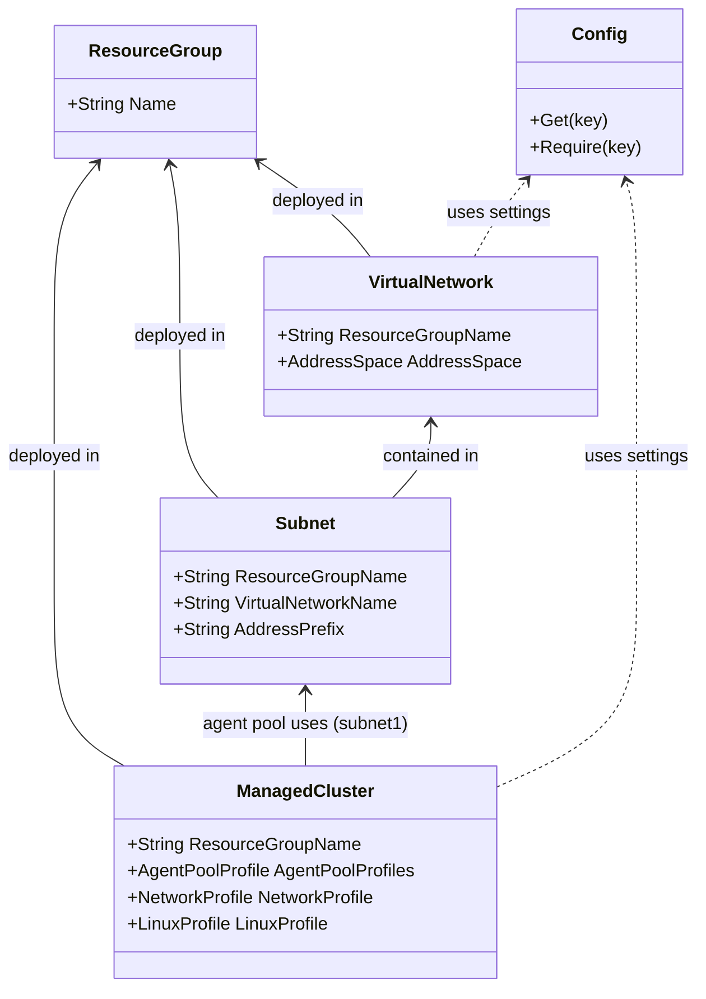

# Pulumi
# Azure
leveraging pluralsight cloud sandboxes with the benefit of using free cloud resources for quick and clean experimentation.

when using pluralsight cloud sandboxes some restrictions are in place
https://help.pluralsight.com/hc/en-us/articles/24392988447636-Azure-cloud-sandbox

## DotNet Azure classes

